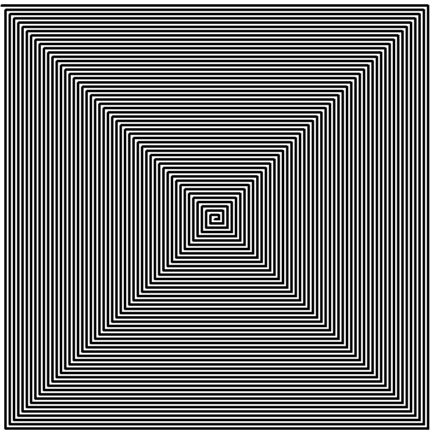

# AutomatedPainters

Hey, these are some Python coded automated painters that can paint automatically in MS Paint.

To run Painter: *Just run it* 

**BUT..**

To run Painter2: Open MS Paint
                 Choose the pencil, its colour and size
                 Then run the program and switch and place the pencil in position(You will have 10 seconds for that!)
                
That's it!

Here are the images of the output:-

->Indian Flag and some text by Painter

->Spiral by Painter2    

